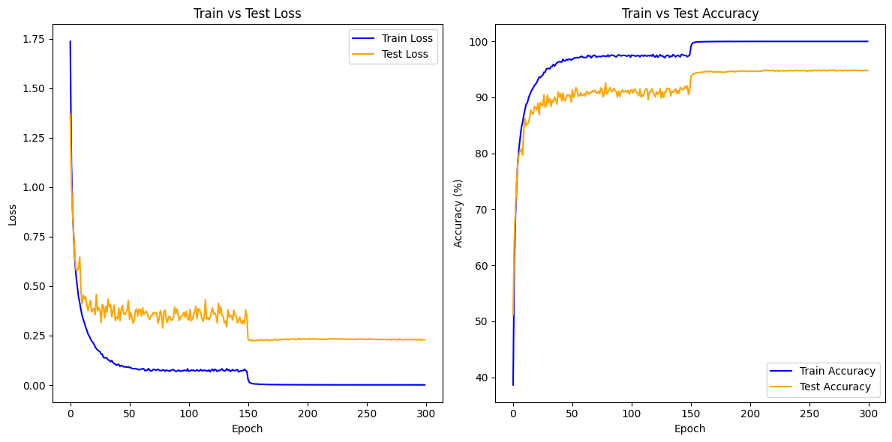

# MobileNetV2 Compression via Pruning and Quantization

This project demonstrates a complete, two-stage compression pipeline for the MobileNetV2 architecture on the CIFAR-10 dataset. The pipeline consists of:
1.  **Magnitude Pruning:** A significant portion of model weights are zeroed out.
2.  **Fine-Tuning:** The pruned model is trained for a few epochs to recover lost accuracy.
3.  **Post-Training Static Quantization (PTSQ):** The weights and activations of the fine-tuned model are quantized to lower bit-widths.

The entire workflow is instrumented with **Weights & Biases (Wandb)** for experiment tracking and visualization.

## 📁 Project Structure

Here is the breakdown of the project files:

```
.
├── train.py                  # Script to train the initial dense model from scratch
├── prune.py                  # Script to prune the dense model and fine-tune it
├── quantization_wandb.py       # Main script for running quantization experiments with Wandb
├── plot.py                   # Script to generate plots from training logs
├── sweep.yaml                # Wandb sweep configuration for the quantization experiments
├── final_weights.pkl         # Saved weights of the fully trained dense model
├── mobilenet_pruned.pkl      # Saved weights of the pruned and fine-tuned model
├── cifar_train_log.csv       # Log file with metrics from the initial training run
├── training.png              # Output plot showing the training progress
├── requirements.txt          # Project dependencies
└── README.md                 # This file
```

## 🚀 Setup and Installation

This project was developed using **Python 3.10**. Follow these steps to set up the environment and install dependencies.

### 1. Create and Activate a Virtual Environment

Choose one of the following methods (`venv` or `conda`).

**Method A: Using `venv` (Python's built-in tool)**

```bash
# 1. Create a virtual environment named 'venv' in your project directory
python -m venv venv

# 2. Activate the environment
# On Windows (Command Prompt or PowerShell):
venv\Scripts\activate
# On macOS and Linux (bash/zsh):
source venv/bin/activate
```

**Method B: Using `conda`**

```bash
# 1. Create a conda environment named 'compression_env' with Python 3.10
conda create --name compression_env python=3.10

# 2. Activate the environment
conda activate compression_env
```

### 2. Install Dependencies

Once your virtual environment is activated, install the required packages from the `requirements.txt` file.

```bash
pip install -r requirements.txt
```

## ⚙️ Workflow Commands

Follow these steps in order to reproduce the results. A random seed of `42` is used across scripts for reproducibility.

**Step 1: Train the Base Dense Model**
This command trains the original MobileNetV2 model. It saves the best weights to **`final_weights.pkl`** and generates the **`training.png`** plot.

```bash
python train.py --epochs 200
```

**Step 2: Prune and Fine-Tune**
This command loads **`final_weights.pkl`**, applies 50% magnitude pruning, and then fine-tunes the model. The final pruned model is saved as **`mobilenet_pruned.pkl`**.

```bash
python prune.py --pruning_ratio 0.5 --finetune_epochs 10
```

**Step 3: Run Quantization Sweep**
This step uses **`mobilenet_pruned.pkl`** and runs a series of quantization experiments.

_Make sure your `sweep.yaml` file points to the correct script: `program: quantization_wandb.py`_

```bash
# 1. Initialize the Wandb sweep
wandb sweep sweep.yaml

# 2. Run the Wandb agent. Replace the sweep ID with the one provided.
wandb agent YOUR_USERNAME/YOUR_PROJECT/SWEEP_ID
```

## 📊 Results

### Base Model Training Performance
The plot below shows the training and validation accuracy/loss curves for the initial dense MobileNetV2 model, as generated by `plot.py`.



### Compression Sweep Results
The quantization experiments demonstrate a clear trade-off between model size, accuracy, and numerical precision. The key findings include:
* **W8A8 (Baseline):** 90.50% accuracy at 2.37 MB.
* **W4A8 (Best Trade-off):** 86.58% accuracy at 1.26 MB (a **7.3x** overall compression ratio).
* **W4A4 (Most Aggressive):** 79.24% accuracy at 1.26 MB.

Full, interactive results, including the Parallel Coordinates chart, can be viewed on the public **[Weights & Biases Project Page](https://wandb.ai/anubhavkhajuria5-indian-institute-of-technology-madras/mobilenet-full-compression)**.
